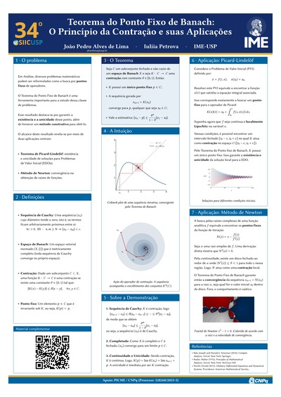

# Teorema do Ponto Fixo de Banach: O Princípio da Contração e suas Aplicações

Pôster apresentado no **34º SIICUSP** (Simpósio Internacional de Iniciação Científica da USP).

**🌐 Site:** https://joao-lima-fis.github.io/banach_ponto_fixo/#cobweb
**📄 PDF (A0):** [poster.pdf](poster.pdf)

## Sobre

O Teorema do Ponto Fixo de Banach garante a **existência e a unicidade** do ponto fixo de uma contração em um espaço métrico completo, e fornece um **método construtivo** para obtê-lo. O pôster apresenta o enunciado, as definições necessárias, a intuição geométrica e um esboço da demonstração, além de duas aplicações:

- **Teorema de Picard-Lindelöf:** existência e unicidade local de soluções de Problemas de Valor Inicial (EDOs).
- **Método de Newton:** convergência local na obtenção de raízes de funções analíticas, com o fractal de Newton para $z^3 - 1 = 0$.

## Autores

- João Pedro Alves de Lima (IME-USP), alveslima@usp.br
- Iuliia Petrova (IME-USP), orientadora

## Apoio

PICME / CNPq (Processo: 128268/2025-5)

## Referências

- Bak, J. e Newman, D. J. (2010). *Complex Analysis*. 3ª ed. Springer.
- Rudin, W. (1976). *Principles of Mathematical Analysis*. 3ª ed. McGraw-Hill.
- Teschl, G. (2012). *Ordinary Differential Equations and Dynamical Systems*. American Mathematical Society.
